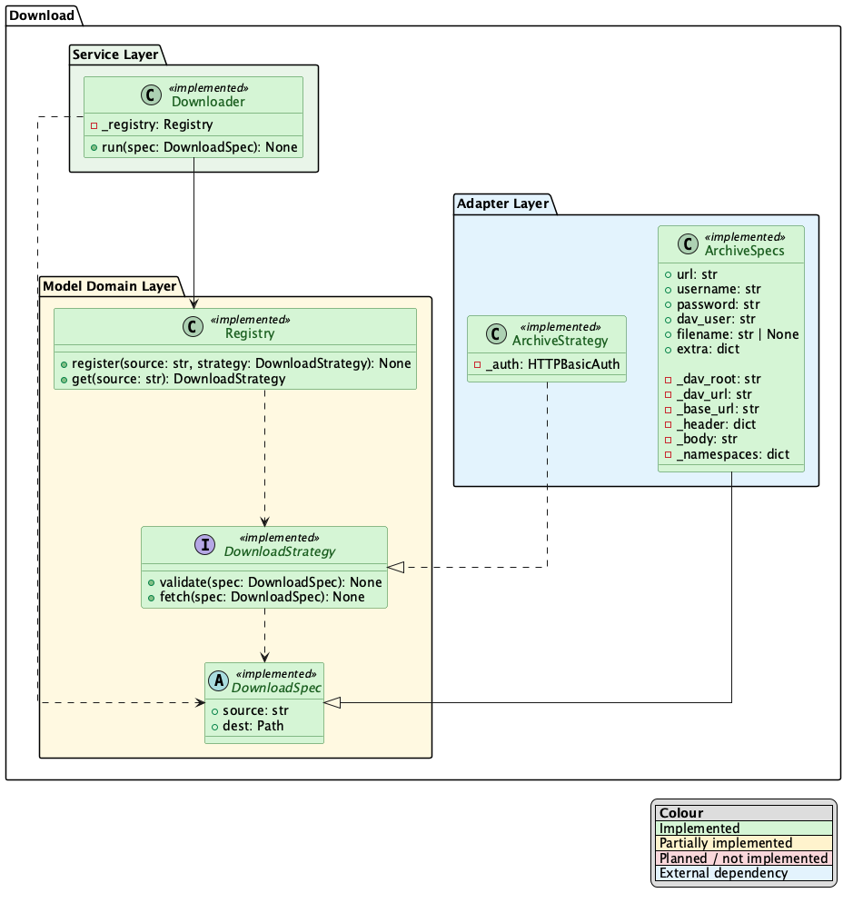

    
    

# BMI-SOFT-Signal_Processing_ML

This repository is responsible for the handling of the EMG decoding pipeline: from the raw data to an effective decoder!

## Handling the Data
Because we have an in-house data acquisition pipeline we need a pipeline for Downloading and Loading the data. The downloading the data is currently being implemented and should follow the following architecture:

The loading the follows a `mne` based approach with simple inheritance from a Loader class

## The Downloader

The downloader lives in `src/bmiemg/download` and is split into three layers: a `service` orchestrator (`Downloader`), the I/O-free `domain` (specs, strategies, registry), and `adapters` that talk to a concrete source. Each source registers its own strategy, so adding one means writing an adapter, not touching the service.

Per-source setup lives with the code: see [`src/bmiemg/download/README.md`](src/bmiemg/download/README.md).
